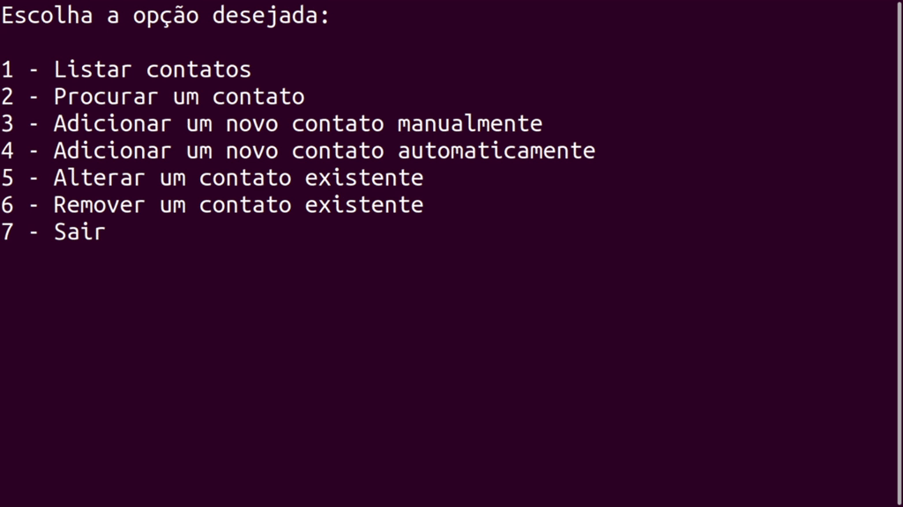

# Agenda de Contatos

Uma agenda de contatos desenvolvida em python com o intuito de fixar os conhecimentos em OOP, gerenciamento de ambientes, banco de dados(MySQL) e web services.



## 🚀 Começando

Essas instruções permitirão que você obtenha uma cópia do projeto para fins de desenvolvimento e teste.

### 📋 Pré-requisitos

Programas necessarios:

```
Python 3.9
MySQL 8.0.22
```

Bibliotecas necessarias: 

```
prettytable 2.0.0
requests 2.25.0
mysql-connector-python 8.0.22
```

### 🔧 Instalação

Como instalar e configurar o projeto.

Baixe e instale as bibliotecas necessarias através do PIP:

```
pip install prettytable
pip install requests 
pip install mysql-connector-python
```

Instale o MySQL:

```
sudo apt install mysql
```
Crie ou altere o usario root da seguinte forma:
```
user = root
password = 
```

Crie um banco no MySQL chamado "agenda":

```
CREATE DATABASE agenda
```
Crie as tabelas do banco "agenda":

```
CREATE TABLE contatos(
        id TINYINT NOT NULL AUTO_INCREMENT PRIMARY KEY,
        nome VARCHAR(255) NOT NULL,
        email VARCHAR(255) NOT NULL,
        telefone VARCHAR(255)
```
Rode o arquivo menu.py e utilize as funções disponiveis.

## 🛠️ Construído com

* [MySQL](https://www.mysql.com/) - Banco de Dados.
* [Prettytable](https://pypi.org/project/prettytable/) - Utilizado para formatar as apresentações dos contatos.
* [Requests](https://pypi.org/project/requests/) - Utilizado para integrar o web service ao codigo.
* [RandomUser](https://randomuser.me/) - API geradora de contatos.

## ✒️ Autores

* **Ruy Araujo** - *Projeto Inicial* - [github](https://github.com/Ruy-Araujo)

Você também pode ver a lista de todos os [colaboradores](https://github.com/usuario/projeto/colaboradores) que participaram deste projeto.

## 📄 Licença

Este projeto está sob a licença (MIT) - veja o arquivo [LICENSE.md](https://github.com/usuario/projeto/licenca) para detalhes.


